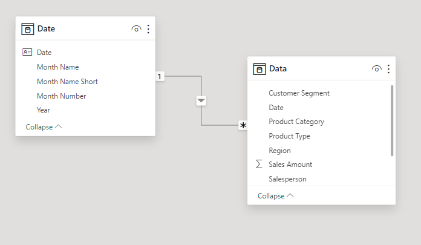

# Sales-Growth

### Introduction
Sales growth is a fundamental metric used to measure the increase in a company's revenue over a specific period of time. It serves as a key indicator of a business's performance, health, and potential for future success. By comparing sales figures from different time periods, such as month-over-month, quarter-over-quarter, or year-over-year, businesses can assess their growth trajectory and make informed decisions about strategies for expansion, investment, and resource allocation. Let's dive into this data set and see how well the company are performing

### Tools Required
The tools required for this project are Power BI and MSExcel. MSExcel for data cleaning and Power BI for visualization and creating of new table. Here is the code for creationg the new table below

### Data Cleaning
Data cleaning is a critical step in the data analysis process that helps ensure the quality and reliability of the data for making informed decisions and drawing meaningful insights.
The dataset was clean, no missing values or duplicate.

### Relatonships between data
These relationships enable the establishment of connections between tables, allowing for efficient querying, retrieval, and manipulation of related data. the relationship between this two table is a Many-to-One (N:1) with a single way relationship. A many-to-one relationship is the inverse of a one-to-many relationship, where many records in one table can be related to exactly one record in another table.

This is the outcome of my visualization 
### Data Visualization

